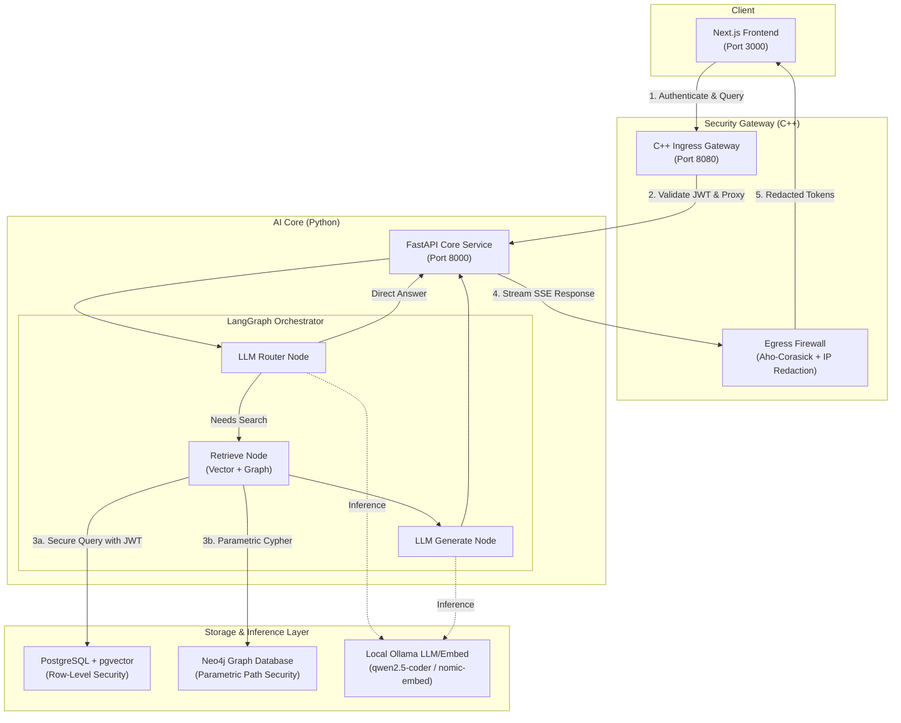

# ⬡ AegisGraph: Sovereign Secure GraphRAG OS

AegisGraph is a high-performance, secure, and sovereign GraphRAG (Retrieval-Augmented Generation) system designed for enterprise environments. It implements **cryptographic multi-tenant isolation, hierarchical clearance boundaries, and compartment overlap controls** across all layers—from the API gateway down to the database storage level.

By combining the agility of Python AI orchestration (FastAPI + LangGraph) with the speed and strictness of a C++ security proxy and entity resolution engine, AegisGraph ensures that sensitive corporate knowledge is stored, traversed, and queried under strict access guardrails.

---

## 🏗️ System Architecture

AegisGraph utilizes a multi-tier architecture to securely process user queries and ingest document data.

### 1. Security Ingress & Egress Gateway (C++)
Located at [gateway/main.cpp](file:///Users/ayon/Repos/AegisGraph/gateway/main.cpp), the gateway serves as the primary firewall:
* **JWT Cryptographic Verification**: Verifies HMAC-SHA256 tokens signed with the corporate secret key at the network boundary.
* **Egress Firewall Class**: Implements an **Aho-Corasick Trie** for high-speed, case-insensitive keyword redaction (e.g., hiding project code names or financial details for unauthorized clearance levels) and sliding-window buffering to handle keywords split across streaming packet boundaries.
* **IP Address Redaction**: Applies regex filters to scrub private IP addresses (RFC 1918) from streaming outputs.

### 2. Secure Storage Engine (PostgreSQL pgvector)
PostgreSQL handles semantic document search at [scripts/init_postgres.sql](file:///Users/ayon/Repos/AegisGraph/scripts/init_postgres.sql):
* **Cryptographic RLS**: Row-Level Security (RLS) is forced. Instead of relying on app-level logic, Postgres verifies JWT signatures inside database triggers using `pgcrypto`.
* **Session Binding**: The function `set_secure_session(token)` decodes claims directly into transaction-local variables (`aegis.org_id`, `aegis.clearance`, etc.).
* **Access Control Policies**: Policies ensure strict data protection:
  1. **Tenant Isolation**: Matches `org_id`.
  2. **Hierarchical Clearance**: User clearance level must be greater than or equal to the document clearance.
  3. **Compartment Overlap (RBAC/ABAC)**: Checks array overlap (`&&`) on user departments and document departments.
  4. **Project ACLs**: If a document is restricted to a project, the user must have that project claim.

### 3. Secure Graph Database (Neo4j)
Traverses corporate entity relationships securely:
* **Parametric Path Constraints**: During Cypher graph traversals (see [core/agent.py](file:///Users/ayon/Repos/AegisGraph/core/agent.py)), constraints verify node-level and relationship-level metadata (clearance, department, project) before returning paths.

### 4. C++ Entity Resolution Module (`aegis_dsu`)
A native C++ pybind11 module located at [gateway/dsu_binder.cpp](file:///Users/ayon/Repos/AegisGraph/gateway/dsu_binder.cpp):
* **Disjoint Set Union (DSU)**: Clusters duplicate, misspelled, or synonymous entities during document ingestion.
* **Jaro-Winkler & Acronym Engine**: Measures name similarities and maps shorthand forms (e.g., "AWS" vs "Amazon Web Services") to a canonical representative node in Neo4j.

---

## 📂 Project Structure

Key system modules and scripts:

* 🖥️ **Frontend**
  * [frontend/app/components/ChatApp.tsx](file:///Users/ayon/Repos/AegisGraph/frontend/app/components/ChatApp.tsx) — Main Next.js interface displaying chat sessions, message threads, and clearance level badges.
  * [frontend/app/api/chat/route.ts](file:///Users/ayon/Repos/AegisGraph/frontend/app/api/chat/route.ts) — Routes chat queries through to the proxy gateway.
  * [frontend/app/globals.css](file:///Users/ayon/Repos/AegisGraph/frontend/app/globals.css) — Custom modern UI styling.
* 🧠 **AI Core**
  * [core/app.py](file:///Users/ayon/Repos/AegisGraph/core/app.py) — FastAPI endpoints for query streaming and file ingestion.
  * [core/agent.py](file:///Users/ayon/Repos/AegisGraph/core/agent.py) — LangGraph state chart containing the LLM Router node, vector/graph retrieval nodes, and LLM generator nodes.
* 🛡️ **Gateway**
  * [gateway/main.cpp](file:///Users/ayon/Repos/AegisGraph/gateway/main.cpp) — Ingress JWT proxy and egress streaming firewall.
  * [gateway/dsu_binder.cpp](file:///Users/ayon/Repos/AegisGraph/gateway/dsu_binder.cpp) — Native pybind11 module for entity canonicalization.
  * [gateway/CMakeLists.txt](file:///Users/ayon/Repos/AegisGraph/gateway/CMakeLists.txt) — High-performance compilation targets.
* ⚙️ **Scripts & Utilities**
  * [scripts/run.sh](file:///Users/ayon/Repos/AegisGraph/scripts/run.sh) — Unified system startup script.
  * [scripts/init_postgres.sql](file:///Users/ayon/Repos/AegisGraph/scripts/init_postgres.sql) — DDL schemas, pgcrypto functions, RLS definitions, and mock users.
  * [scripts/seed_data.py](file:///Users/ayon/Repos/AegisGraph/scripts/seed_data.py) — Seeds corporate test cases and runs direct DB/Graph security verifications.
  * [scripts/ingest.py](file:///Users/ayon/Repos/AegisGraph/scripts/ingest.py) — Text parsing, embedding extraction, C++ DSU entity resolution, and database insertion.
  * [scripts/test_api_endpoints.py](file:///Users/ayon/Repos/AegisGraph/scripts/test_api_endpoints.py) — Automated test suite evaluating privilege escalation boundaries.

---

## 🔐 Multi-Dimensional Security Matrix

AegisGraph ships with 4 preconfigured test users mapped in [scripts/init_postgres.sql](file:///Users/ayon/Repos/AegisGraph/scripts/init_postgres.sql). These users represent different access boundaries:

| User | Role | Clearance Level | Departments | Active Projects | Expected Access Profile |
| :--- | :--- | :--- | :--- | :--- | :--- |
| `alice_intern` | Intern | **1 (Low)** | Engineering, Support | *None* | Can read general coding guides. Cannot view engine details, salary details, or M&A info. |
| `bob_engineer` | Engineer | **2 (Medium)** | Engineering | CoreEngine | Can read coding guides & Core Engine specs. Blocked from HR salary details and M&A info. |
| `carol_hr` | HR Manager | **2 (Medium)** | HR | CompensationReview | Can view HR compensation bands. Blocked from Engineering files & M&A info. |
| `dave_executive`| Executive | **3 (High)** | Executive, Finance, Engineering | Mergers, CoreEngine | Full access to Engineering guides, specs, and competitor M&A projects. Blocked from HR. |

> [!IMPORTANT]
> **Password for all default users:** `password123`

---

## 🚀 Getting Started

### Prerequisites

Ensure you have the following services installed and running locally:
1. **Ollama**: Download from [ollama.com](https://ollama.com) and start the service.
   ```bash
   ollama pull qwen2.5-coder:7b
   ollama pull nomic-embed-text
   ```
2. **PostgreSQL**: Must support `pgvector`. (Make sure it is listening on port `5432`).
3. **Neo4j**: Must be running on bolt port `7687` and HTTP port `7474`.
4. **CMake & gcc/clang**: Required to build the C++ components.
5. **OpenSSL**: Gateway depends on OpenSSL for cryptographic JWT operations.

---

### Running the Services

Use the automated start script [scripts/run.sh](file:///Users/ayon/Repos/AegisGraph/scripts/run.sh) in the project root. It will:
1. Check that Ollama, PostgreSQL, and Neo4j are alive.
2. Initialize a Python virtual environment (`.venv`) and install pip dependencies.
3. Apply the database schemas from [scripts/init_postgres.sql](file:///Users/ayon/Repos/AegisGraph/scripts/init_postgres.sql).
4. Run the data seeding pipeline via [scripts/seed_data.py](file:///Users/ayon/Repos/AegisGraph/scripts/seed_data.py).
5. Build the C++ Gateway and pybind11 `aegis_dsu` modules using CMake.
6. Install Next.js dependencies.
7. Launch all three servers concurrently (Frontend, FastAPI Core, and C++ Gateway) and stream log outputs with prefixes.

```bash
chmod +x scripts/run.sh
./scripts/run.sh
```

Once running, access the services here:
* 🌐 **Frontend UI**: [http://localhost:3000](http://localhost:3000)
* 🛡️ **C++ Security Gateway**: [http://localhost:8080](http://localhost:8080)
* 🐍 **Python AI Backend**: [http://localhost:8000](http://localhost:8000)
* 📄 **FastAPI API Docs**: [http://localhost:8000/docs](http://localhost:8000/docs)

---

## 🧪 Testing & Validation

AegisGraph incorporates comprehensive testing pipelines to guarantee security boundaries hold under pressure.

### 1. Database & Traversal Level Verification
[scripts/seed_data.py](file:///Users/ayon/Repos/AegisGraph/scripts/seed_data.py) executes automated database and graph traversal queries, simulating each role to verify that data is either successfully loaded or cryptographically hidden.

To manually trigger the database tests:
```bash
source .venv/bin/activate
python scripts/seed_data.py
```

### 2. API Security & Privilege Escalation Tests
[scripts/test_api_endpoints.py](file:///Users/ayon/Repos/AegisGraph/scripts/test_api_endpoints.py) sends concurrent queries to the C++ Gateway using different role credentials. It tests boundaries such as:
* Intern attempting to view M&A data (escalation block).
* Attacker sending queries with tampered JWT signatures (crypto reject).
* Attacker sending expired JWT tokens (temporal reject).
* Engineers attempting to view salary brackets (department block).

To run API integration tests:
```bash
source .venv/bin/activate
python scripts/test_api_endpoints.py
```

> [!TIP]
> The integration tests will exit with a summary statement showing response latency times and whether the RLS policies successfully blocked unauthorized information leakage.
